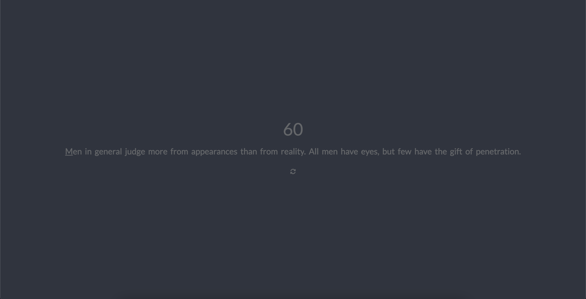

<div align="center">
  <h1 align="center">speedtype</h1>
  <p align="center">
    Minimalistic 60 seconds typing test
    <br />
    <br />
    
    <br />
    <a href="">View Demo</a>

  </p>
</div>


## Built With
---


## Getting Started
---

### Prerequisites

* npm
  ```sh
  npm install npm@latest -g
  ```

### Installation

1. Clone the repo
   ```sh
   git clone https://github.com/your_username_/Project-Name.git
   ```
2. Install NPM packages
   ```sh
   npm install
   ```
3. Run using NPM 
   ```js
    npm run dev
   ```

## Roadmap
---

- [ ] Add Additional Themes
- [ ] Add ticking animation on key input
- More to come!


made by Samuel Swandi - [Linkedin](https://www.linkedin.com/in/samuelswandi/)


